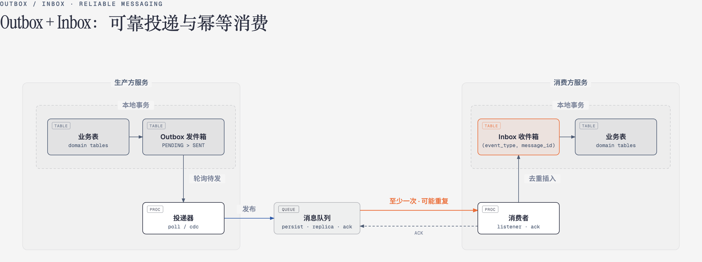

# Outbox/Inbox 模式如何保证可靠投递和消费

## 整体链路

生产方在本地事务中同时写业务表和发件箱；投递器把待发消息发布到消息队列；消费者以至少一次的语义收到消息，先落收件箱去重，再在同一本地事务中完成业务处理。图中两个虚线框即两处本地事务边界，也是整个方案不依赖分布式事务的关键。

可靠性由三段共同保证：

| 环节   | 目标                             | 机制                   |
| ------ | -------------------------------- | ---------------------- |
| 生产端 | 业务成功则消息一定发出           | Outbox 模式 + 本地事务 |
| 传输端 | 消息不丢                         | MQ 持久化 + ACK 机制   |
| 消费端 | 消息收到则一定处理，且只处理一次 | Inbox 模式 + 幂等消费  |

## 生产端：Outbox 模式

**要解决的问题**：业务写库和发消息是两个操作，不在同一事务里，可能不一致。

**做法**：

1. 在同一个本地事务中，同时完成：
   - 更新业务表；
   - 向 Outbox 表插入一条 `status = PENDING` 的记录。
2. 事务提交后，由后台进程（轮询或 CDC）从 Outbox 表读取待发送记录，投递到 MQ。
3. 投递成功后，更新 `status = SENT`；失败则累计重试次数、记录失败原因，按退避间隔安排下次重试，超过阈值转死信处理。

**保证**：

- 业务成功 → Outbox 记录一定存在 → 消息最终一定被投递。
- 业务失败 → 事务回滚 → 消息不会发出。
- 投递失败可重试，不会丢消息。

**关键设计**：

- Outbox 表与业务表同库，共享本地事务。
- Outbox 记录的 `id` 作为 `message_id`，连同 `event_type` 一并传给下游，供消费端按组合唯一键去重。
- 轮询待发送记录必须走部分索引（只索引待投递与待重试状态），否则每次轮询都是全表扫描，这是 Outbox 模式最常见的性能坑。
- 投递语义是**至少一次（at-least-once）**，可能重复，所以消费端必须幂等。

## 传输端：MQ 的可靠性

**要解决的问题**：消息在 broker 里不能丢。

**做法**：

- **持久化**：消息写入磁盘，broker 重启不丢。
- **副本**：Kafka 多副本、RabbitMQ 镜像队列，防止单点故障。
- **ACK 机制**：生产方等待 broker 确认写入成功，才算投递完成。
- **重试**：投递失败时重试，配合 Outbox 表的 `retry_count` 和 `last_error`。

**保证**：消息一旦进入 MQ，就不会因为 broker 故障而丢失。

**注意**：传输端仍然可能重复投递（如 ACK 丢失导致重发），所以整体语义仍是**至少一次**。

## 消费端：Inbox 模式

**要解决的问题**：消息可能重复投递，业务处理必须幂等。

**做法**：

1. 消费者收到消息后，**不直接执行业务逻辑**，而是先尝试向 Inbox 表插入一条 `status = PENDING` 的记录：
   - 插入成功：第一次收到，向 MQ 发送 ACK；
   - 插入冲突：已收到过，直接 ACK 跳过。
2. 后台处理进程从 Inbox 表取出待处理记录，置为 `PROCESSING`，在同一本地事务中执行业务逻辑、更新消费方业务表。
3. 处理成功标记 `status = SUCCESS`；失败标记 `FAILED`，由后台进程重试，超过阈值转死信。

**保证**：

- 重复消息被唯一索引拦截，业务只执行一次。
- 接收与处理解耦：落库成功即 ACK，即使后续处理失败，消息也不会丢，可从 Inbox 表重试。

**关键设计**：

- Inbox 表与消费方业务表同库，“去重插入 + 业务处理”都在本地事务中完成。
- 去重靠 `(event_type, message_id)` 组合唯一索引；`message_id` 取自生产方 Outbox 记录的 `id`。
- 一个服务消费多个 topic，仍只需一张 Inbox 表。

## 端到端语义

| 环节          | 语义                     |
| ------------- | ------------------------ |
| 生产端 Outbox | 至少一次投递             |
| 传输端 MQ     | 至少一次投递             |
| 消费端 Inbox  | 幂等消费，效果上恰好一次 |

**组合结果**：

至少一次投递 + 幂等消费 = 效果上的恰好一次处理（effectively exactly-once）

这是分布式系统中在不依赖分布式事务的前提下，实现可靠消息传递的标准方案：Outbox 保证“业务成功则消息一定发出”，MQ 保证“消息在传输中不丢”，Inbox 保证“消息收到则一定处理且只处理一次”。

## 关键字段说明

两张表共享几个容易混淆的字段，含义与分工如下：

| 字段           | 含义与用途                                                     |
| -------------- | -------------------------------------------------------------- |
| aggregate_id   | 聚合根ID，标识事件发生在哪个业务对象上（如订单号）             |
| aggregate_type | 聚合类型，标识业务对象是什么（如订单、支付单）                 |
| event_type     | 事件类型，回答“发生了什么”（如订单已创建、订单已退款）         |
| topic          | 主题，回答“消息发到哪、从哪来”，是消息中间件的路由地址         |

**aggregate_id 的三重作用**：

- 顺序锚点：消息按它分区，同一聚合进同一分区，这是顺序保证的来源；
- 串行依据：消费端处理时，同一聚合的消息需串行执行，避免乱序相互覆盖；
- 排查入口：消息出问题时，凭它在发件箱与收件箱之间对上同一笔业务，两表都为它建了索引。

**为什么有了 event_type 还需要 topic**：两者是“内容”与“地址”的分工。event_type 描述事件本身，topic 是投递地址，常见关系是一对多：一个业务域一个 topic，里面放该域的多种事件（如订单主题下同时有创建、支付、退款事件）。消费端先按 topic 订阅（粗粒度），再按 event_type 分发到具体处理器（细粒度）。去重键用 event_type 而非 topic，也是取它粒度更细：不同事件类型的消息ID互不干扰。

## 关键设计点速查

| 问题                           | 答案                                                            |
| ------------------------------ | --------------------------------------------------------------- |
| Outbox 表放哪                  | 生产方业务库，与业务表同事务                                    |
| Inbox 表放哪                   | 消费方业务库，与业务表同事务                                    |
| message_id 怎么来              | Outbox 记录的 id，与 event_type 组成唯一键                      |
| 如何保证不丢                   | Outbox 本地事务 + MQ 持久化 + Inbox 先落库                     |
| 如何保证不重                   | Inbox 表 (event_type, message_id) 组合唯一索引                  |
| 消费多个 topic 要几张 Inbox 表 | 一张，加 topic 字段记录来源                                     |
| 消息顺序怎么保证               | 按 aggregate_id 分区，同一聚合进同一分区                       |
| 投递失败怎么办                 | 记录重试次数与失败原因，按退避间隔重试，超阈值转死信           |
| 处理失败怎么办                 | 收件箱同口径：记录重试与错误，按退避间隔重试                   |
| 多实例同时轮询怎么办           | 取数加 FOR UPDATE SKIP LOCKED，各实例取不同记录互不阻塞       |
| 轮询会不会拖垮数据库           | 按待处理状态建部分索引，控制每轮批量与频率                     |
| 想按业务单据追溯消息           | 两表都以聚合根ID建索引，收件箱另有消息ID索引                   |
| 表会无限增长怎么办             | 定期归档或删除已完成记录，保留时间覆盖最大重投延迟             |
